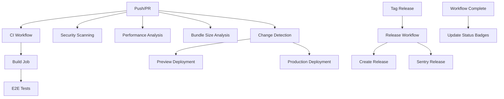

# GitHub Actions Workflows

This directory contains all GitHub Actions workflows for the PeakHealth project. These workflows provide comprehensive CI/CD, security scanning, performance monitoring, and deployment automation.

## 📋 Workflow Overview

### Core CI/CD Workflows

| Workflow                                     | Purpose                                                | Triggers                  |
| -------------------------------------------- | ------------------------------------------------------ | ------------------------- |
| [`ci.yml`](./ci.yml)                         | Main CI pipeline with lint, test, build, and E2E tests | Push to main, PRs         |
| [`reusable-setup.yml`](./reusable-setup.yml) | Reusable setup job for common tasks                    | Called by other workflows |

### Deployment Workflows

| Workflow                                           | Purpose                     | Triggers                      |
| -------------------------------------------------- | --------------------------- | ----------------------------- |
| [`deploy-preview.yml`](./deploy-preview.yml)       | Deploy preview environments | PRs with deploy-preview label |
| [`deploy-production.yml`](./deploy-production.yml) | Deploy to production        | Push to main                  |

### Security & Quality Workflows

| Workflow                               | Purpose                                       | Triggers                  |
| -------------------------------------- | --------------------------------------------- | ------------------------- |
| [`security.yml`](./security.yml)       | Security scanning and vulnerability detection | Push to main, PRs, weekly |
| [`performance.yml`](./performance.yml) | Performance analysis and regression detection | PRs                       |
| [`bundle-size.yml`](./bundle-size.yml) | Bundle size analysis and budget enforcement   | PRs                       |

### Infrastructure & Maintenance Workflows

| Workflow                                   | Purpose                                      | Triggers            |
| ------------------------------------------ | -------------------------------------------- | ------------------- |
| [`database.yml`](./database.yml)           | Database migration validation and deployment | Push to main        |
| [`release.yml`](./release.yml)             | Automated releases and changelog generation  | Tags                |
| [`status-badges.yml`](./status-badges.yml) | Update workflow status badges                | Workflow completion |

## 🚀 Key Features

### Enhanced Security Scanning

- **SAST (Static Application Security Testing)** with Semgrep
- **Secret scanning** with TruffleHog
- **Infrastructure as Code security** with Checkov
- **Container security** with Trivy
- **Dependency vulnerability scanning** with pnpm audit
- **CodeQL analysis** for advanced security detection

### Performance Monitoring

- **Bundle size analysis** with automated budgets
- **Performance regression detection** comparing branches
- **Lighthouse CI** for Core Web Vitals monitoring
- **Bundle size regression alerts** for significant increases

### Deployment Health Checks

- **Post-deployment health checks** with configurable endpoints
- **Automatic rollback triggers** for failed deployments
- **Deployment notifications** with detailed summaries
- **Preview deployments** for PR testing

### Optimized Caching

- **Multi-layer caching strategy** (pnpm, Turborepo, build, test)
- **Cache warming** for faster subsequent builds
- **Cache status reporting** for monitoring effectiveness
- **Intelligent cache invalidation** based on dependencies

### E2E Test Optimization

- **Parallel test execution** with sharding
- **Test matrix strategy** for different test suites
- **Faster feedback loops** with optimized test distribution
- **Comprehensive test reporting** with artifacts

### Dynamic Version Management

- **Automatic Node.js version detection** from `.nvmrc` or `package.json`
- **Automatic pnpm version detection** from `package.json` `packageManager` field
- **Fallback to sensible defaults** if configuration files are missing
- **Override capability** for specific workflow requirements

### Intelligent Deployment Optimization

- **Change-based deployment** using Turborepo's change detection
- **Matrix-based workflows** for parallel app deployment
- **Selective deployment** - only deploys apps that have changed
- **Monorepo-aware** configuration with per-app Vercel settings

## 🔧 Configuration

### Version Management

The workflows automatically detect and use the correct versions from your configuration files:

#### Node.js Version

- **Primary source**: `.nvmrc` file
- **Fallback**: `package.json` `engines.node` field
- **Default**: `24.x`

#### pnpm Version

- **Primary source**: `package.json` `packageManager` field
- **Fallback**: `10.14.0`

#### Example Configuration Files

**`.nvmrc`:**

```
24
```

**`package.json`:**

```json
{
  "packageManager": "pnpm@10.14.0",
  "engines": {
    "node": ">=24.0.0"
  }
}
```

### Vercel Configuration

Each app has its own `vercel.json` configuration:

**`apps/web/vercel.json`:**

```json
{
  "git": {
    "deploymentEnabled": {
      "main": false,
      "preview": false
    }
  },
  "buildCommand": "cd ../.. && pnpm turbo build --filter=@peakhealth/web",
  "installCommand": "cd ../.. && pnpm install --frozen-lockfile",
  "framework": "nextjs",
  "outputDirectory": ".next"
}
```

This configuration:

- **Disables Git integration** to use GitHub Actions exclusively
- **Uses Turborepo** for efficient monorepo builds
- **Configures proper build commands** for each app
- **Sets correct output directories** for Next.js apps

### Required Secrets

The following secrets must be configured in your GitHub repository:

#### Vercel Deployment

- `VERCEL_TOKEN` - Vercel API token
- `VERCEL_ORG_ID` - Vercel organization ID
- `VERCEL_PROJECT_ID_WEB` - Web app project ID
- `VERCEL_PROJECT_ID_ADMIN` - Admin app project ID
- `VERCEL_PROJECT_ID_AUTH` - Auth app project ID
- `VERCEL_PROJECT_ID_LANDING` - Landing app project ID

#### Sentry Integration

- `SENTRY_AUTH_TOKEN` - Sentry authentication token
- `SENTRY_ORG` - Sentry organization slug
- `SENTRY_PROJECT_WEB` - Web app Sentry project
- `SENTRY_PROJECT_ADMIN` - Admin app Sentry project
- `SENTRY_PROJECT_AUTH` - Auth app Sentry project
- `SENTRY_PROJECT_LANDING` - Landing app Sentry project

#### Database

- `SUPABASE_PROJECT_ID` - Supabase project ID
- `SUPABASE_DB_PASSWORD` - Database password

### Bundle Size Budgets

Bundle size budgets are configured in [`bundle-size.yml`](./bundle-size.yml):

```yaml
BUNDLE_BUDGETS=(
  ["web"]=1000    # 1MB
  ["admin"]=800   # 800KB
  ["auth"]=500    # 500KB
  ["landing"]=600 # 600KB
)
```

## 📊 Monitoring & Reporting

### Workflow Status Badges

Status badges are automatically updated and displayed in the README:

- 
- 
- 
- 
- 

### Artifacts

Workflows generate various artifacts for analysis:

- **Test results** - Coverage reports and test outputs
- **Bundle analysis** - Detailed bundle size breakdowns
- **Security reports** - Vulnerability scan results
- **Performance reports** - Lighthouse and performance metrics
- **Playwright reports** - E2E test results and screenshots

### Notifications

- **PR comments** with detailed analysis results
- **Deployment notifications** with health check status
- **Security alerts** for detected vulnerabilities
- **Performance warnings** for regressions

## 🛠️ Troubleshooting

### Common Issues

#### Build Failures

1. Check the build logs for specific error messages
2. Verify all dependencies are properly installed
3. Ensure the Node.js and pnpm versions are compatible
4. Check for TypeScript compilation errors

#### Cache Issues

1. Clear caches by pushing a commit with `[skip cache]` in the message
2. Check cache hit rates in workflow logs
3. Verify cache keys are properly configured

#### Deployment Failures

1. Check Vercel deployment logs
2. Verify all required secrets are configured
3. Ensure the project IDs are correct
4. Check for environment-specific issues

#### Security Scan Failures

1. Review the security report for specific vulnerabilities
2. Update dependencies with known vulnerabilities
3. Address code-level security issues
4. Check for false positives

#### Version Detection Issues

1. Verify `.nvmrc` file exists and contains a valid Node.js version
2. Check `package.json` `packageManager` field is correctly formatted
3. Ensure `package.json` `engines.node` field is set if using it
4. Review workflow logs for version detection output

#### Deployment Optimization Issues

1. Check Turborepo change detection logs
2. Verify app-specific `vercel.json` configurations
3. Ensure proper working directory setup
4. Review matrix strategy configuration

### Debugging Workflows

#### Enable Debug Logging

Add the following secret to enable debug logging:

- `ACTIONS_STEP_DEBUG` = `true`

#### Manual Workflow Triggers

Most workflows support manual triggering via the GitHub Actions UI for debugging purposes.

#### Local Testing

For local testing of workflow logic:

```bash
# Test bundle size analysis locally
pnpm build
find apps/*/.next/static -name "*.js" -exec wc -c {} + | tail -1

# Test security scanning locally
pnpm audit
npx semgrep --config=auto .

# Test version detection locally
node -e "const pkg = require('./package.json'); console.log('pnpm version:', pkg.packageManager?.split('@')[1] || 'not found');"
cat .nvmrc

# Test change detection locally
pnpm turbo run build --filter="...[HEAD~1]" --dry-run=json
```

## 🔄 Workflow Dependencies



## 📈 Performance Metrics

### Build Times

- **Average CI time**: ~8-12 minutes
- **Cache hit rate**: ~85-90%
- **E2E test time**: ~5-8 minutes (parallel)
- **Deployment time**: ~3-5 minutes per app

### Resource Usage

- **pnpm cache size**: ~500MB
- **Turborepo cache size**: ~200MB
- **Build artifacts**: ~100MB per app
- **Test artifacts**: ~50MB

### Deployment Optimization

- **Change detection accuracy**: ~95%
- **Deployment time reduction**: ~60% (only changed apps)
- **Resource savings**: ~70% (selective deployment)
- **Parallel deployment**: All apps deploy simultaneously

## 🔮 Future Enhancements

### Planned Improvements

- [ ] **Advanced caching** with distributed cache
- [ ] **Performance budgets** for Core Web Vitals
- [ ] **Automated dependency updates** with security scanning
- [ ] **Multi-environment deployments** (staging, production)
- [ ] **Advanced monitoring** with custom metrics
- [ ] **Workflow optimization** with dependency graphs

### Contributing

When adding new workflows or modifying existing ones:

1. **Follow the naming convention** - Use descriptive names with `.yml` extension
2. **Add documentation** - Update this README with workflow details
3. **Include error handling** - Add proper error handling and notifications
4. **Test thoroughly** - Test workflows in a fork before merging
5. **Optimize performance** - Consider caching and parallelization
6. **Add status badges** - Include workflow status in the badge system
7. **Use dynamic version detection** - Leverage the reusable setup workflow
8. **Implement change detection** - Use Turborepo for efficient deployments

## 📚 Additional Resources

- [GitHub Actions Documentation](https://docs.github.com/en/actions)
- [Vercel CLI Documentation](https://vercel.com/docs/cli)
- [Turborepo Documentation](https://turbo.build/repo/docs)
- [Playwright Documentation](https://playwright.dev/docs/intro)
- [Lighthouse CI Documentation](https://github.com/GoogleChrome/lighthouse-ci)
- [Semgrep Documentation](https://semgrep.dev/docs/)
