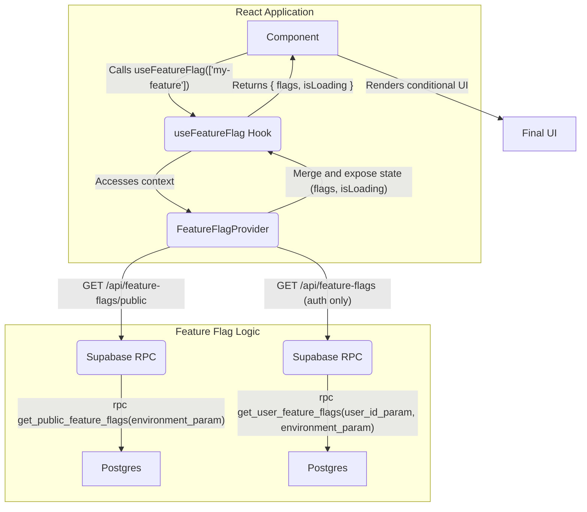
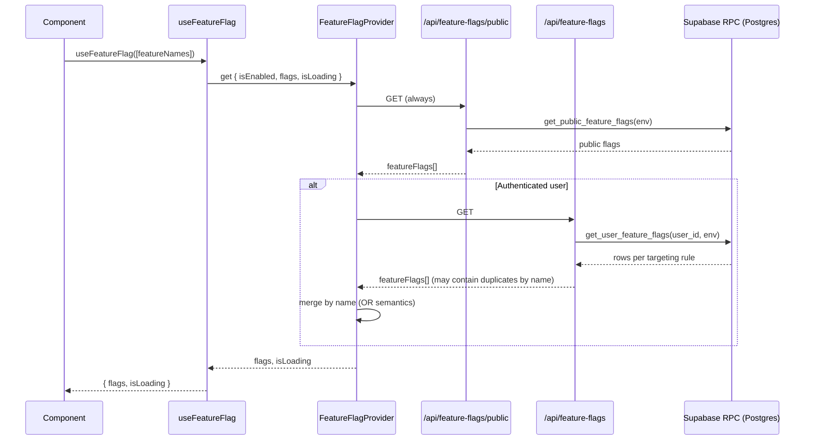
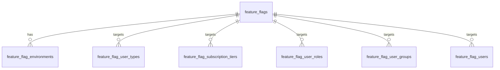
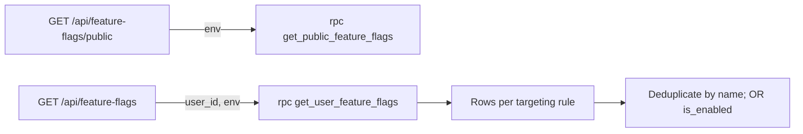
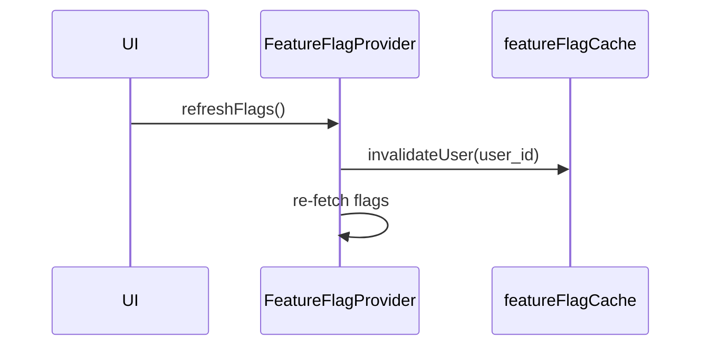

# Feature Flag System

A comprehensive feature flag system for the Peak Health app that supports user types, legacy roles, user groups, subscription tiers, and environment-based targeting with database-level security filtering.

## System Workflow

This diagram provides a visual representation of the data flow within the feature flag system, from a component request to the database and back.



### Explanation of the Flow

1. **Component Request**: A React component initiates the process by calling the `useFeatureFlag` hook with an array of feature names it needs to check.
2. **Context Access**: The `useFeatureFlag` hook accesses the `FeatureFlagProvider` to get the current state and the `isEnabled` function.
3. **Public Flags Load**: For all users (authenticated and unauthenticated), the system first loads public feature flags via `/api/feature-flags/public`.
4. **User-Specific Flags Load**: For authenticated users, the system then loads user-specific flags via `/api/feature-flags` with targeting derived from JWT claims.
5. **Targeting**: The `get_user_feature_flags` function evaluates targeting based on user types, subscription tier, legacy roles, and legacy groups present in JWT claims.
6. **Merging**: If a feature appears multiple times via different targeting rules, the system merges them by name using OR semantics (enabled if any rule enables it).
7. **State Provision**: The `FeatureFlagProvider` exposes the latest state (flags and `isLoading`) to the hook.
8. **Hook Return**: The `useFeatureFlag` hook returns the final state to the calling component.
9. **UI Render**: The component uses the flag status to render the appropriate UI.

Note on caching: a cache utility exists and is used for invalidation on refresh, but is not currently used to serve reads in the provider (details below).

## High-Level Sequence



## Features

- **User Type Targeting (new)**: Target features based on user types (e.g., `regular`, `trainer`, `physio`, `admin`)
- **Subscription Tier Targeting (new)**: Target features by subscription tier (e.g., `free`, `premium`, `pro`)
- **Legacy Role/Group Targeting**: Backward-compatible targeting by `roles` and `groups` from JWT claims
- **Environment Support**: Separate configurations for development, staging, and production
- **Security Filtering**: Database-level filtering ensures users only see features they're authorized for
- **Public Flags**: Flags available to all users (no authentication required)
- **Merging Semantics**: Multiple targeting rules per feature are merged by name with OR semantics
- **Rollout Percentage**: Consistent user bucketing via hash on `(user_id, flag_id)` per environment
- **Monitoring Ready**: Built-in monitoring hooks (console-based in development)
- **Audit Trail**: Change tracking via `feature_flag_audit_log`
- **TypeScript Support**: Strict types across hooks, provider, and API

## Project Structure

The feature flag system is organized within `apps/web/src/features/feature-flags/`:

```text
apps/web/src/features/feature-flags/
├── types/
│   └── index.ts                 # All TypeScript interfaces and types
├── lib/
│   ├── config.ts               # Configuration and constants
│   ├── cache.ts                # Caching layer
│   └── monitoring.ts           # Monitoring infrastructure
├── context/
│   └── FeatureFlagContext.tsx  # Main context provider
├── hooks/
│   └── useFeatureFlag.ts       # Main feature flag hook
└── index.ts                    # Main export file
```

## Database Schema

The system uses the following tables:

- `feature_flags` — Feature flag definitions; includes `is_public` and `is_global`
- `feature_flag_environments` — Environment-specific configuration per flag
- `feature_flag_user_types` — Targeting by user type (new system)
- `feature_flag_subscription_tiers` — Targeting by subscription tier (new system)
- `feature_flag_users` — Explicit per-user targeting
- `feature_flag_user_roles` — Targeting by legacy roles (backward compatibility)
- `feature_flag_user_groups` — Targeting by legacy groups (backward compatibility)
- `feature_flag_audit_log` — Change tracking

### Key Functions

- `get_public_feature_flags(environment_param)` — Returns public flags for all users
- `get_user_feature_flags(user_id_param, environment_param)` — Returns user-specific flags derived from JWT claims via `auth.users.raw_app_meta_data` (user types, subscription tier, roles, groups)
- `get_user_feature_flags_legacy(user_id, environment_param, user_roles, user_groups)` — Legacy signature taking explicit arrays (not used by current API)
- `user_has_role(user_roles, role_name)` and `user_in_group(user_groups, group_name)` — Legacy helpers

### Entity Relationships



### get_user_feature_flags logic (simplified)

```mermaid
flowchart TD
  A[Inputs: user_id, environment] --> B{Union of targetings}
  B --> C[Global flags (is_global=true)]
  B --> D[Explicit user targeting]
  B --> E[Legacy roles targeting]
  B --> F[Legacy groups targeting]
  B --> G[User type targeting]
  B --> H[Subscription tier targeting]
  C --> I[Apply rollout percentage via hash(user_id, flag_id)]
  D --> I
  E --> I
  F --> I
  G --> I
  H --> I
  I --> J[Return rows: name, description, is_enabled, rollout_percentage, environment, targeting_type, targeting_value]
```

Rollout calculation: enabled if `rollout_percentage = 100`, disabled if `0`, otherwise bucketed per user with a stable hash of `(user_id, flag_id)` compared to the rollout threshold.

## Setup

### 1. Run Database Migration

```bash
# Apply the migration to your Supabase database
supabase db push
```

### 2. Add FeatureFlagProvider to Your App

```tsx
// In your main layout or app component
import { FeatureFlagProvider } from '@/features/feature-flags';

function App() {
  return (
    <AuthProvider>
      <FeatureFlagProvider>{/* Your app components */}</FeatureFlagProvider>
    </AuthProvider>
  );
}
```

## Usage

### Using the useFeatureFlag Hook

```tsx
import { useFeatureFlag, FEATURE_FLAGS } from '@/features/feature-flags';

function MyComponent() {
  const { flags, isLoading } = useFeatureFlag([
    FEATURE_FLAGS.NOTIFICATION_SYSTEM_FEATURE,
  ]);

  if (isLoading) return <div>Loading...</div>;

  return (
    <div>
      {flags[FEATURE_FLAGS.NOTIFICATION_SYSTEM_FEATURE] ? (
        <NotificationsComponent />
      ) : (
        <NoNotificationsMessage />
      )}
    </div>
  );
}
```

### Using the useFeatureFlags Hook for More Control

The `useFeatureFlags` hook gives you direct access to the context, which is useful for more complex scenarios, such as checking user types or groups.

```tsx
import {
  useFeatureFlags,
  USER_TYPES,
  USER_GROUPS,
} from '@/features/feature-flags';

function MyComponent() {
  const { hasUserType, isInGroup, isEnabled } = useFeatureFlags();

  // Check user types (new model)
  const isAdmin = hasUserType(USER_TYPES.ADMIN);
  const isTrainer = hasUserType(USER_TYPES.TRAINER);

  // Check user groups (legacy/back-compat)
  const isBetaUser = isInGroup(USER_GROUPS.BETA);
  const isPremiumGroup = isInGroup(USER_GROUPS.PREMIUM);

  // Check feature flags
  const hasNotifications = isEnabled('notification_system_feature');

  return (
    <div>
      {isAdmin && <AdminPanel />}
      {isTrainer && <TrainerTools />}
      {isBetaUser && <BetaInfo />}
      {isPremiumGroup && <PremiumFeatures />}
      {hasNotifications && <Notifications />}
    </div>
  );
}
```

## Configuration

### Environment Variables

```env
# Feature Flag Configuration
FEATURE_FLAG_MONITORING_ENABLED=false
FEATURE_FLAG_MONITORING_ENDPOINT=
FEATURE_FLAG_MONITORING_API_KEY=
FEATURE_FLAG_CACHE_TTL=300000
FEATURE_FLAG_ANALYTICS_ENABLED=true
NEXT_PUBLIC_ENVIRONMENT=development
```

### Feature Flag Constants

```tsx
import {
  FEATURE_FLAGS,
  USER_TYPES,
  USER_GROUPS,
} from '@/features/feature-flags';

// Available feature flags (subset)
FEATURE_FLAGS.NOTIFICATION_SYSTEM_FEATURE;
FEATURE_FLAGS.DASHBOARD_FEATURE;

// Available user types (new model)
USER_TYPES.REGULAR;
USER_TYPES.TRAINER;
USER_TYPES.PHYSIO;
USER_TYPES.ADMIN;

// Available user groups (legacy/back-compat)
USER_GROUPS.BETA;
USER_GROUPS.PREMIUM;
USER_GROUPS.EARLY_ACCESS;
```

### API Routes and Return Shapes



- `/api/feature-flags/public` returns: `{ featureFlags: Array<{ name, is_enabled, rollout_percentage }> }`
- `/api/feature-flags` returns rows that may include: `{ feature_flag_id, name, description, is_enabled, rollout_percentage, environment, targeting_type, targeting_value }` merged by name with OR semantics.

## Testing

### Manual Testing

1. **Set User Roles**: Update user metadata to include roles (e.g., `['premium', 'admin']`)
2. **Set User Groups**: Update user metadata to include groups (e.g., `['beta_testers', 'premium']`)
3. **Toggle Feature Flags**: Enable/disable feature flags in different environments
4. **Test Targeting**: Verify that features appear/disappear based on user roles and groups
5. **Test Public Flags**: Verify that public flags are available to all users (authenticated and unauthenticated)

## Database Management

### Set User Roles and Groups

User roles and groups are stored in Supabase's built-in `user_metadata` field. You can update them via the Supabase dashboard or API:

```sql
-- Update user metadata to include roles and groups
UPDATE auth.users
SET user_metadata = jsonb_set(
  COALESCE(user_metadata, '{}'::jsonb),
  '{roles}',
  '["premium", "admin"]'::jsonb
)
WHERE id = 'user-uuid';

UPDATE auth.users
SET user_metadata = jsonb_set(
  COALESCE(user_metadata, '{}'::jsonb),
  '{groups}',
  '["beta_testers", "premium"]'::jsonb
)
WHERE id = 'user-uuid';
```

### Create Feature Flags

```sql
-- Create a new public feature flag (available to all users)
INSERT INTO feature_flags (name, display_name, description, is_public)
VALUES ('public_announcement', 'Public Announcement', 'Show announcement to all users', true);

-- Create a new user-specific feature flag
INSERT INTO feature_flags (name, display_name, description, is_public)
VALUES ('premium_feature', 'Premium Feature', 'Premium users only feature', false);

-- Enable flags for specific environment
INSERT INTO feature_flag_environments (feature_flag_id, environment, is_enabled, rollout_percentage)
SELECT id, 'production', true, 100 FROM feature_flags WHERE name = 'premium_feature';

-- Target specific user roles
INSERT INTO feature_flag_user_roles (feature_flag_id, environment, role_name, is_enabled)
SELECT id, 'production', 'premium', true FROM feature_flags WHERE name = 'premium_feature';

-- Target specific user groups
INSERT INTO feature_flag_user_groups (feature_flag_id, environment, group_name, is_enabled)
SELECT id, 'production', 'beta_testers', true FROM feature_flags WHERE name = 'premium_feature';
```

## Performance

- **Rollout bucketing**: Stable per-user hashing ensures consistent inclusion/exclusion across sessions
- **Union-based query**: Single RPC consolidates multiple targeting sources
- **Indexes**: Dedicated indexes for each table support query performance
- **Lazy loading**: Data is fetched on demand in the provider

## Monitoring (Current & Future)

- **Current**: Console-based monitoring in development via `featureFlagMonitor`
  - `trackFeatureFlagUsage`, `trackFeatureFlagPerformance`, `trackFeatureFlagError`, cache hit/miss hooks
- **Future**: Optional external endpoint via `FEATURE_FLAG_MONITORING_*` envs

## Security

- **Row Level Security (RLS)**: Enabled across all feature flag tables
- **Claim-based filtering**: User types, subscription tier, roles, and groups read from JWT claims via `auth.users.raw_app_meta_data`
- **Public vs user-specific flags**: `is_public` separates anonymous flags from authenticated flags; `is_global` marks broad authenticated access
- **Audit Trail**: All changes logged in `feature_flag_audit_log`
- **Type Safety**: Strict typing for API shapes and hook returns

## Caching & Refresh

- A `featureFlagCache` utility exists with TTL-based `get`, and invalidation helpers
- The provider currently uses cache for invalidation on `refreshFlags()`; reads are fetched via `fetch` without cache lookups
- Future optimization could integrate `featureFlagCache.get` around network calls



## API Errors & Edge Cases

- `USER_NOT_FOUND` (401): Returned by `/api/feature-flags` when JWT refers to a user not present in DB; the client clears flags and stops loading
- Non-array responses from API are safely handled, defaulting to empty maps
- Deduplication by name ensures multiple targeting rows do not double-count

## Next Steps

1. **Integration**: Add the `FeatureFlagProvider` to your app layout
2. **Configuration**: Set `NEXT_PUBLIC_ENVIRONMENT` and optional monitoring envs
3. **Targeting**: Prefer user types and subscription tiers; keep legacy roles/groups only for back-compat
4. **Monitoring**: Enable external monitoring if needed

## Known Mismatches & Caveats (documented, not fixed)

- **Function signature in docs vs code**: Previous docs referenced `get_user_feature_flags(user_id, environment, user_roles, user_groups)`; the active function is `get_user_feature_flags(user_id_param, environment_param)` that reads claims directly. A legacy function `get_user_feature_flags_legacy` exists with the extended signature.
- **API route not passing roles/groups**: `/api/feature-flags` computes `userRoles` and `userGroups` from JWT but does not pass them to RPC; this matches the current DB function that reads claims directly.
- **Caching narrative vs implementation**: Docs historically implied a read cache; current provider only uses cache invalidation on refresh and does not call `featureFlagCache.get` during reads.
- **User roles vs user types**: The new model uses `USER_TYPES`; code exposes `hasUserType` and not `hasUserRole`. Any references to `USER_ROLES` are legacy.
- **Legacy component gate**: A `FeatureFlagProtected` component exists for route gating (uses utility classes). The preferred approach is hook-driven gating; component-based gating is considered legacy.
- **Alternate server-side pattern**: `apps/web/src/app/(app)/dashboard/page.tsx` directly queries tables to check a flag (e.g., `DASHBOARD_FEATURE`) instead of using RPC; this bypasses the consolidation/merging done by the API route.
- **Public flags constraint**: `get_public_feature_flags` enforces no role/group targeting for public flags; ensure schema changes keep this invariant.

These items are intentionally documented here for visibility and future cleanup; no code has been changed as part of this documentation update.

## Related Documentation

- [Role/Group Filtering](./ROLE_GROUP_FILTERING.md) — Legacy role/group filtering details and examples
