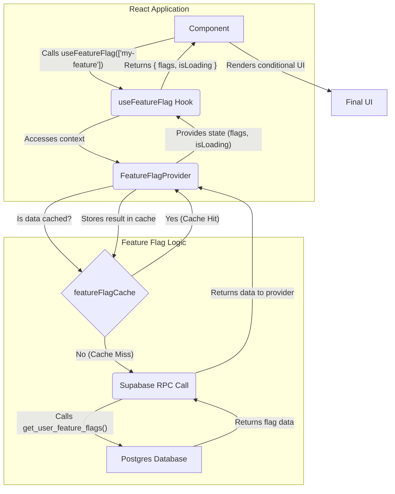

# Feature Flag System

A comprehensive feature flag system for the Peak Health app that supports user roles, user groups, and environment-based targeting with proper security filtering.

## System Workflow

This diagram provides a visual representation of the data flow within the feature flag system, from a component request to the database and back.



### Explanation of the Flow

1.  **Component Request**: A React component initiates the process by calling the `useFeatureFlag` hook with an array of feature names it needs to check.
2.  **Context Access**: The `useFeatureFlag` hook accesses the `FeatureFlagProvider` to get the current state and the `isEnabled` function.
3.  **Public Flags Load**: For all users (authenticated and unauthenticated), the system first loads public feature flags via `/api/feature-flags/public`.
4.  **User-Specific Flags Load**: For authenticated users, the system then loads user-specific flags via `/api/feature-flags` with proper role/group filtering.
5.  **Role/Group Filtering**: The `get_user_feature_flags` database function filters flags based on the user's roles and groups, ensuring users only see features they're authorized for.
6.  **Cache Check**: The `FeatureFlagProvider` checks the `featureFlagCache` to see if the requested data is already available and not expired. If it is, the provider immediately uses the cached data (Cache Hit).
7.  **Cache Miss & API Call**: If the data is not in the cache (a "cache miss"), the provider makes API calls to the backend.
8.  **Database Query**: The database functions query the relevant tables to determine which flags are active for the current user and environment.
9.  **Data Return**: The database functions return the filtered flag data to the `FeatureFlagProvider`.
10. **Cache Update**: The provider updates the `featureFlagCache` with the newly fetched data for future requests.
11. **State Provision**: The `FeatureFlagProvider` makes the latest state (flags and `isLoading` status) available to the hook.
12. **Hook Return**: The `useFeatureFlag` hook returns the final state to the calling component.
13. **UI Render**: The component uses the flag's status to render the appropriate UI.

## Features

- **User Role Targeting**: Target features based on user roles (basic, premium, admin)
- **User Group Targeting**: Target features based on user groups (free, beta_testers, premium)
- **Environment Support**: Different configurations for development, staging, and production
- **Security Filtering**: Database-level filtering ensures users only see features they're authorized for
- **Public Flags**: Support for flags available to all users (no authentication required)
- **Caching**: Built-in caching for performance optimization
- **Monitoring Ready**: Infrastructure for future monitoring integration
- **Audit Trail**: Track changes to feature flags
- **TypeScript Support**: Full type safety throughout the system

## Project Structure

The feature flag system is organized within the `src/features/feature-flags/` directory:

```
src/features/feature-flags/
├── types/
│   └── index.ts                 # All TypeScript interfaces and types
├── lib/
│   ├── config.ts               # Configuration and constants
│   ├── cache.ts                # Caching layer
│   └── monitoring.ts           # Monitoring infrastructure
├── context/
│   └── FeatureFlagContext.tsx  # Main context provider
├── hooks/
│   └── useFeatureFlag.ts       # Main feature flag hook
└── index.ts                    # Main export file
```

## Database Schema

The system uses the following tables:

- `feature_flags` - Feature flag definitions (with `is_public` flag to distinguish public vs user-specific flags)
- `feature_flag_environments` - Environment-specific configurations
- `feature_flag_user_roles` - Role-based targeting rules
- `feature_flag_user_groups` - Group-based targeting rules
- `feature_flag_audit_log` - Change tracking

### Key Functions

- `get_public_feature_flags(environment_param)` - Returns public flags available to all users
- `get_user_feature_flags(user_id, environment_param, user_roles, user_groups)` - Returns user-specific flags filtered by roles/groups
- `user_has_role(user_roles, role_name)` - Helper function to check if user has a specific role
- `user_in_group(user_groups, group_name)` - Helper function to check if user belongs to a specific group

## Setup

### 1. Run Database Migration

```bash
# Apply the migration to your Supabase database
supabase db push
```

### 2. Add FeatureFlagProvider to Your App

```tsx
// In your main layout or app component
import { FeatureFlagProvider } from '@/features/feature-flags';

function App() {
  return (
    <AuthProvider>
      <FeatureFlagProvider>{/* Your app components */}</FeatureFlagProvider>
    </AuthProvider>
  );
}
```

## Usage

### Using the useFeatureFlag Hook

```tsx
import { useFeatureFlag, FEATURE_FLAGS } from '@/features/feature-flags';

function MyComponent() {
  const { flags, isLoading } = useFeatureFlag([
    FEATURE_FLAGS.NOTIFICATION_SYSTEM_FEATURE,
  ]);

  if (isLoading) return <div>Loading...</div>;

  return (
    <div>
      {flags[FEATURE_FLAGS.NOTIFICATION_SYSTEM_FEATURE] ? (
        <NotificationsComponent />
      ) : (
        <NoNotificationsMessage />
      )}
    </div>
  );
}
```

### Using the useFeatureFlags Hook for More Control

The `useFeatureFlags` hook gives you direct access to the context, which is useful for more complex scenarios, such as checking user roles or groups.

```tsx
import {
  useFeatureFlags,
  USER_ROLES,
  USER_GROUPS,
} from '@/features/feature-flags';

function MyComponent() {
  const { hasUserRole, isInGroup, isEnabled } = useFeatureFlags();

  // Check user roles
  const isPremium = hasUserRole(USER_ROLES.PREMIUM);
  const isAdmin = hasUserRole(USER_ROLES.ADMIN);

  // Check user groups
  const isBetaUser = isInGroup(USER_GROUPS.BETA_TESTERS);
  const isPremiumUser = isInGroup(USER_GROUPS.PREMIUM);

  // Check feature flags
  const hasNotifications = isEnabled('notification_system_feature');

  return (
    <div>
      {isPremium && <PremiumDashboard />}
      {isPremiumUser && <PremiumFeatures />}
      {hasNotifications && <NotificationsComponent />}
    </div>
  );
}
```

## Configuration

### Environment Variables

```env
# Feature Flag Configuration
FEATURE_FLAG_MONITORING_ENABLED=false
FEATURE_FLAG_MONITORING_ENDPOINT=
FEATURE_FLAG_MONITORING_API_KEY=
FEATURE_FLAG_CACHE_TTL=300000
FEATURE_FLAG_ANALYTICS_ENABLED=true
NEXT_PUBLIC_ENVIRONMENT=development
```

### Feature Flag Constants

```tsx
import {
  FEATURE_FLAGS,
  USER_ROLES,
  USER_GROUPS,
} from '@/features/feature-flags';

// Available feature flags
FEATURE_FLAGS.NOTIFICATION_SYSTEM_FEATURE;

// Available user roles
USER_ROLES.BASIC;
USER_ROLES.PREMIUM;
USER_ROLES.ADMIN;

// Available user groups
USER_GROUPS.FREE;
USER_GROUPS.BETA_TESTERS;
USER_GROUPS.PREMIUM;
```

## Testing

### Manual Testing

1. **Set User Roles**: Update user metadata to include roles (e.g., `['premium', 'admin']`)
2. **Set User Groups**: Update user metadata to include groups (e.g., `['beta_testers', 'premium']`)
3. **Toggle Feature Flags**: Enable/disable feature flags in different environments
4. **Test Targeting**: Verify that features appear/disappear based on user roles and groups
5. **Test Public Flags**: Verify that public flags are available to all users (authenticated and unauthenticated)

## Database Management

### Set User Roles and Groups

User roles and groups are stored in Supabase's built-in `user_metadata` field. You can update them via the Supabase dashboard or API:

```sql
-- Update user metadata to include roles and groups
UPDATE auth.users
SET user_metadata = jsonb_set(
  COALESCE(user_metadata, '{}'::jsonb),
  '{roles}',
  '["premium", "admin"]'::jsonb
)
WHERE id = 'user-uuid';

UPDATE auth.users
SET user_metadata = jsonb_set(
  COALESCE(user_metadata, '{}'::jsonb),
  '{groups}',
  '["beta_testers", "premium"]'::jsonb
)
WHERE id = 'user-uuid';
```

### Create Feature Flags

```sql
-- Create a new public feature flag (available to all users)
INSERT INTO feature_flags (name, display_name, description, is_public)
VALUES ('public_announcement', 'Public Announcement', 'Show announcement to all users', true);

-- Create a new user-specific feature flag
INSERT INTO feature_flags (name, display_name, description, is_public)
VALUES ('premium_feature', 'Premium Feature', 'Premium users only feature', false);

-- Enable flags for specific environment
INSERT INTO feature_flag_environments (feature_flag_id, environment, is_enabled, rollout_percentage)
SELECT id, 'production', true, 100 FROM feature_flags WHERE name = 'premium_feature';

-- Target specific user roles
INSERT INTO feature_flag_user_roles (feature_flag_id, environment, role_name, is_enabled)
SELECT id, 'production', 'premium', true FROM feature_flags WHERE name = 'premium_feature';

-- Target specific user groups
INSERT INTO feature_flag_user_groups (feature_flag_id, environment, group_name, is_enabled)
SELECT id, 'production', 'beta_testers', true FROM feature_flags WHERE name = 'premium_feature';
```

## Performance

- **Caching**: Feature flags are cached for 5 minutes by default
- **Single Query**: All user data is loaded in one query
- **Indexes**: Database indexes for optimal query performance
- **Lazy Loading**: Data is only loaded when needed

## Monitoring (Future)

The system is designed to support monitoring integration:

- Performance metrics tracking
- Usage analytics
- Error tracking
- Health checks

## Security

- **Row Level Security (RLS)**: All tables have RLS enabled
- **User Isolation**: Users can only see their own data
- **Role/Group Filtering**: Database-level filtering ensures users only see features they're authorized for
- **Public vs User-Specific Flags**: Clear separation between flags available to all users vs. authenticated users only
- **Audit Trail**: All changes are logged
- **Type Safety**: Full TypeScript support prevents runtime errors

## Next Steps

1. **Integration**: Add the FeatureFlagProvider to your app
2. **Testing**: Test the notification system feature flag
3. **User Setup**: Set up user roles and groups in user metadata
4. **Feature Flags**: Create and configure feature flags for your features
5. **Monitoring**: Enable monitoring when ready

## Related Documentation

- [Role/Group Filtering](./ROLE_GROUP_FILTERING.md) - Detailed explanation of the role/group filtering system
