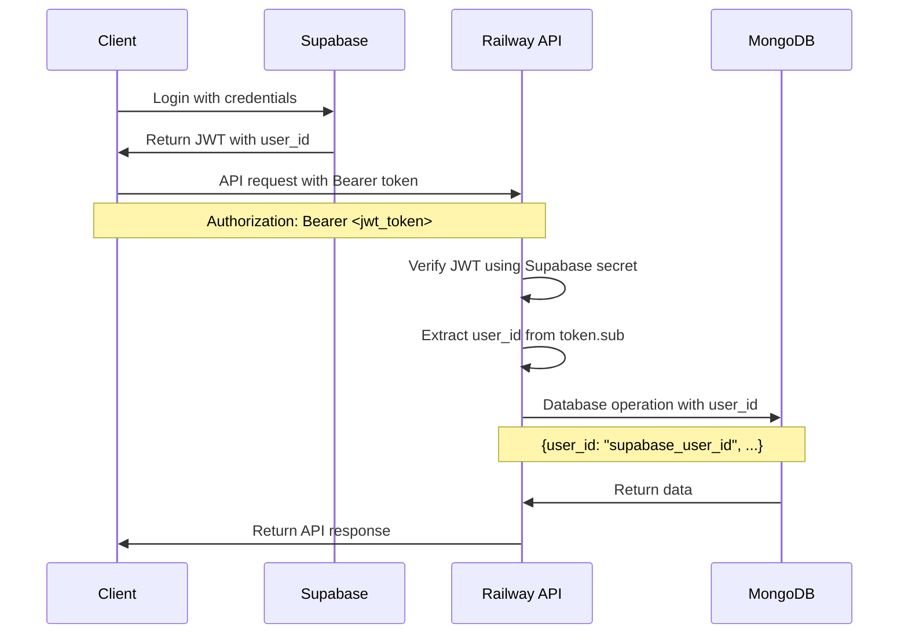

# Supabase Authentication with Railway Backend

## Overview

This document explains how to implement Supabase authentication with a Railway backend API. The approach uses Supabase for user authentication and JWT generation, then verifies these JWTs directly in the Railway backend to link data with authenticated users.

## How It Works

### Authentication Flow



### Key Concepts

1. **Supabase handles authentication**: User login, registration, and JWT generation
2. **Client sends JWT as Bearer token**: Include in Authorization header for all API requests
3. **Railway verifies JWT**: Use Supabase secret to verify token authenticity
4. **Extract user_id**: Get user identification from JWT claims
5. **Link data with user**: Associate all database operations with the authenticated user

## Implementation

### Railway Backend Setup

#### Environment Variables

```bash
# Railway Environment Variables
SUPABASE_JWT_SECRET=your_supabase_jwt_secret
MONGODB_URI=mongodb://your_mongodb_connection_string
DATABASE_NAME=routines_api
```

#### JWT Verification Middleware

```typescript
// middleware/auth.ts
import jwt from 'jsonwebtoken';
import { Request, Response, NextFunction } from 'express';

export const verifySupabaseJWT = (req: Request, res: Response, next: NextFunction) => {
  try {
    // Extract Bearer token from Authorization header
    const authHeader = req.headers.authorization;
    if (!authHeader || !authHeader.startsWith('Bearer ')) {
      return res.status(401).json({ error: 'No valid token provided' });
    }
    
    const token = authHeader.substring(7); // Remove 'Bearer ' prefix
    
    // Verify the JWT using Supabase secret
    const decoded = jwt.verify(token, process.env.SUPABASE_JWT_SECRET!) as any;
    
    // Extract user information from verified token
    req.user = {
      id: decoded.sub,        // Supabase user_id
      email: decoded.email,
      role: decoded.role || 'user'
    };
    
    next();
  } catch (error) {
    return res.status(401).json({ error: 'Invalid token' });
  }
};
```

#### Express.js Application Setup

```typescript
// app.ts
import express from 'express';
import { MongoClient } from 'mongodb';
import { verifySupabaseJWT } from './middleware/auth';

const app = express();
app.use(express.json());

// Connect to MongoDB
const client = new MongoClient(process.env.MONGODB_URI!);
const db = client.db(process.env.DATABASE_NAME);

// Protected routes - require authentication
app.post('/api/routines', verifySupabaseJWT, async (req, res) => {
  try {
    const routine = {
      user_id: req.user.id,     // Link to Supabase user
      title: req.body.title,
      description: req.body.description,
      exercises: req.body.exercises,
      created_at: new Date(),
      updated_at: new Date()
    };
    
    const result = await db.collection('routines').insertOne(routine);
    res.json({ id: result.insertedId, ...routine });
  } catch (error) {
    res.status(500).json({ error: 'Failed to create routine' });
  }
});

app.get('/api/routines', verifySupabaseJWT, async (req, res) => {
  try {
    // Only return routines for the authenticated user
    const routines = await db.collection('routines')
      .find({ user_id: req.user.id })
      .toArray();
    
    res.json(routines);
  } catch (error) {
    res.status(500).json({ error: 'Failed to fetch routines' });
  }
});

app.put('/api/routines/:id', verifySupabaseJWT, async (req, res) => {
  try {
    const { id } = req.params;
    const updates = {
      ...req.body,
      updated_at: new Date()
    };
    
    // Only allow updates to user's own routines
    const result = await db.collection('routines').updateOne(
      { _id: new ObjectId(id), user_id: req.user.id },
      { $set: updates }
    );
    
    if (result.matchedCount === 0) {
      return res.status(404).json({ error: 'Routine not found' });
    }
    
    res.json({ success: true });
  } catch (error) {
    res.status(500).json({ error: 'Failed to update routine' });
  }
});

app.delete('/api/routines/:id', verifySupabaseJWT, async (req, res) => {
  try {
    const { id } = req.params;
    
    // Only allow deletion of user's own routines
    const result = await db.collection('routines').deleteOne({
      _id: new ObjectId(id),
      user_id: req.user.id
    });
    
    if (result.deletedCount === 0) {
      return res.status(404).json({ error: 'Routine not found' });
    }
    
    res.json({ success: true });
  } catch (error) {
    res.status(500).json({ error: 'Failed to delete routine' });
  }
});

// Start server
const PORT = process.env.PORT || 3000;
app.listen(PORT, () => {
  console.log(`Server running on port ${PORT}`);
});
```

### Client-Side Implementation

#### React/Next.js Client

```typescript
// lib/api.ts
import { createClient } from '@supabase/supabase-js';

const supabase = createClient(
  process.env.NEXT_PUBLIC_SUPABASE_URL!,
  process.env.NEXT_PUBLIC_SUPABASE_ANON_KEY!
);

export const makeApiRequest = async (endpoint: string, options: RequestInit = {}) => {
  // Get current session
  const { data: { session } } = await supabase.auth.getSession();
  
  if (!session) {
    throw new Error('No authenticated session');
  }
  
  const response = await fetch(`https://your-app.railway.app${endpoint}`, {
    ...options,
    headers: {
      'Authorization': `Bearer ${session.access_token}`,
      'Content-Type': 'application/json',
      ...options.headers,
    },
  });
  
  if (!response.ok) {
    throw new Error(`API request failed: ${response.statusText}`);
  }
  
  return response.json();
};

// API functions
export const routinesApi = {
  create: (routine: any) => makeApiRequest('/api/routines', {
    method: 'POST',
    body: JSON.stringify(routine)
  }),
  
  getAll: () => makeApiRequest('/api/routines'),
  
  update: (id: string, updates: any) => makeApiRequest(`/api/routines/${id}`, {
    method: 'PUT',
    body: JSON.stringify(updates)
  }),
  
  delete: (id: string) => makeApiRequest(`/api/routines/${id}`, {
    method: 'DELETE'
  })
};
```

#### Usage in Components

```typescript
// components/RoutineForm.tsx
import { routinesApi } from '../lib/api';

export const RoutineForm = () => {
  const handleSubmit = async (formData: any) => {
    try {
      const newRoutine = await routinesApi.create({
        title: formData.title,
        description: formData.description,
        exercises: formData.exercises
      });
      
      console.log('Routine created:', newRoutine);
    } catch (error) {
      console.error('Failed to create routine:', error);
    }
  };
  
  return (
    <form onSubmit={handleSubmit}>
      {/* Form fields */}
    </form>
  );
};
```

## Railway Deployment

### Railway Configuration

```yaml
# railway.toml
[build]
builder = "nixpacks"

[deploy]
startCommand = "npm start"
healthcheckPath = "/health"
healthcheckTimeout = 300

[[services]]
name = "routines-api"
port = 3000
```

### Environment Variables in Railway

1. Go to your Railway project dashboard
2. Navigate to the Variables tab
3. Add the following environment variables:
   - `SUPABASE_JWT_SECRET`: Get this from your Supabase dashboard
   - `MONGODB_URI`: Your MongoDB connection string
   - `DATABASE_NAME`: Your database name

### Getting Supabase JWT Secret

1. Go to your Supabase project dashboard
2. Navigate to Settings → API
3. Copy the "JWT Secret" value
4. Add it to Railway environment variables as `SUPABASE_JWT_SECRET`

## Security Considerations

### JWT Security
- **Keep JWT secret secure**: Never commit it to version control
- **Use HTTPS**: Railway provides HTTPS by default
- **Validate tokens**: Always verify JWT signature and expiration
- **Short expiration**: Supabase JWTs typically expire in 1 hour

### Data Security
- **User isolation**: Always filter data by user_id
- **Input validation**: Validate all request data
- **Error handling**: Don't expose sensitive information in errors
- **Rate limiting**: Implement rate limiting for API endpoints

### Best Practices
- **Use environment variables**: Store secrets in Railway environment variables
- **Log authentication events**: Monitor for suspicious activity
- **Regular updates**: Keep dependencies updated
- **Health checks**: Implement health check endpoints

## Testing

### Local Development

```typescript
// test/auth.test.ts
import request from 'supertest';
import jwt from 'jsonwebtoken';

describe('Authentication', () => {
  it('should reject requests without token', async () => {
    const response = await request(app)
      .get('/api/routines')
      .expect(401);
    
    expect(response.body.error).toBe('No valid token provided');
  });
  
  it('should accept requests with valid token', async () => {
    const token = jwt.sign(
      { sub: 'test-user-id', email: 'test@example.com' },
      process.env.SUPABASE_JWT_SECRET!
    );
    
    const response = await request(app)
      .get('/api/routines')
      .set('Authorization', `Bearer ${token}`)
      .expect(200);
    
    expect(Array.isArray(response.body)).toBe(true);
  });
});
```

### API Testing

```bash
# Test with curl
curl -X GET https://your-app.railway.app/api/routines \
  -H "Authorization: Bearer YOUR_JWT_TOKEN" \
  -H "Content-Type: application/json"
```

## Conclusion

This approach provides a clean separation of concerns:
- **Supabase handles authentication** and user management
- **Railway handles business logic** and data storage
- **JWT tokens link everything together** securely

The implementation is simple, secure, and scalable, making it perfect for the Routines API feature.
