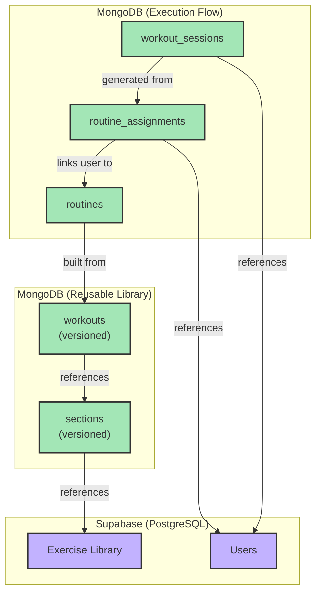

# MongoDB Database Schema

## Overview

This directory defines the MongoDB collections and their schemas for the PeakHealth application. The schema is a direct implementation of the concepts outlined in the [Data Models documentation](../data-models/README.md). It is designed to be flexible for complex workout structures while maintaining data integrity through versioning and snapshots.

The core principle is the separation between **The Plan** (the structure of routines) and **The Action** (the execution of workouts by users).

## Collections

The database consists of five primary collections that work together to provide reusability for creators and immutability for users.

-   **[sections.md](./sections.md)**: Stores reusable, version-controlled section templates (e.g., a specific warmup or EMOM block).
-   **[workouts.md](./workouts.md)**: Stores reusable, version-controlled workout templates, which can be built from reusable sections.
-   **[routines.md](./routines.md)**: Stores all routine documents. `TemplateRoutine`s are built by referencing versioned workouts and sections, which are then snapshotted into an immutable, fully embedded document upon saving a new version.
-   **[routine_assignments.md](./routine_assignments.md)**: Links users to a specific, immutable version of a `TemplateRoutine`.
-   **[workout_sessions.md](./workout_sessions.md)**: Contains every scheduled workout, including an immutable `workoutSnapshot` taken from the assigned routine version.

**Note on User and Exercise Data:** User profiles and the master exercise library are managed in **Supabase**.

## Key Design Principles

-   **Multi-Layered Versioning & Immutability**: The architecture uses a "snapshot of a snapshot" approach for maximum data integrity:
    1.  **Library Versioning**: Reusable `workouts` and `sections` are versioned, allowing creators to update templates without breaking existing routines.
    2.  **Snapshot on Routine Versioning**: When a `TemplateRoutine` version is saved, all references to reusable components are resolved and their data is deeply embedded. This creates a self-contained, immutable plan.
    3.  **Snapshot on Session Scheduling**: When a `WorkoutSession` is scheduled, it takes an immutable `workoutSnapshot` from the assigned routine version, guaranteeing the user's historical record is never altered.

-   **Hybrid Reference Model**: During creation, routines can reference reusable components, providing a flexible building experience. The final saved document is always fully embedded.

## Data Relationships

