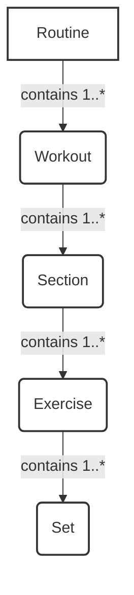

# 1. The Building Blocks of a Workout Plan

The Routines feature is built on a hierarchical structure. Understanding these components is key to understanding the feature.

## 1.1 Routine
A **Routine** is the highest-level container. It represents a complete, structured workout program designed to help a user achieve a specific fitness goal over a period of time (e.g., a "6-Week Strength Building Plan").

There are two main types of routines:
- **Template Routine**: A read-only blueprint created by trainers or the company. Users can be assigned these routines to follow.
- **User-Created Routine**: A routine that a user creates for themselves, or by copying and modifying a template. It is fully editable by the user.

## 1.2 Workout
A **Workout** represents a single day's training session within a routine (e.g., "Day 1: Upper Body Strength"). A routine is composed of one or more workouts.

Workouts can be of different types, such as:
- Strength Training
- Running (including Trail Running)

## 1.3 Section
A **Section** is a distinct phase within a workout. Workouts are composed of one or more sections. Examples include:
- Warmup
- Main Lift
- EMOM (Every Minute on the Minute)
- Cooldown
- Intervals (for running)

## 1.4 Exercise
An **Exercise** is a specific movement performed within a section (e.g., "Barbell Squat", "Push-up").

## 1.5 Set
A **Set** defines a single group of repetitions for an exercise. It includes details like:
- Repetitions (reps)
- Weight or resistance
- Duration
- Rest time

## Visualizing the Hierarchy

