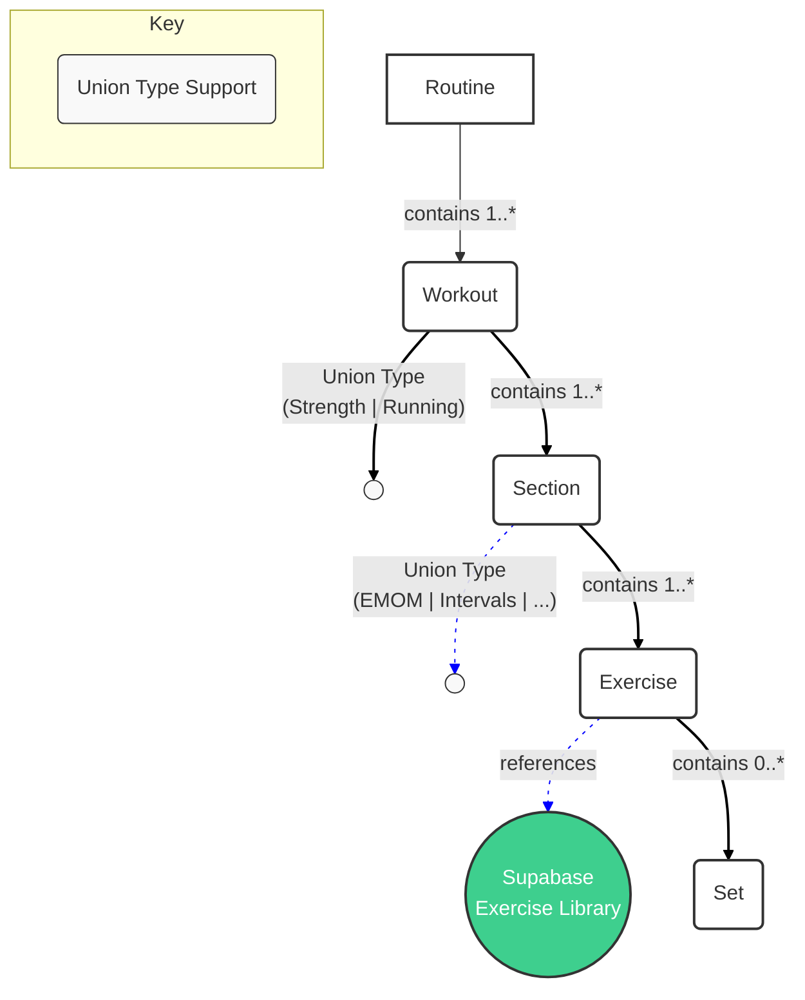
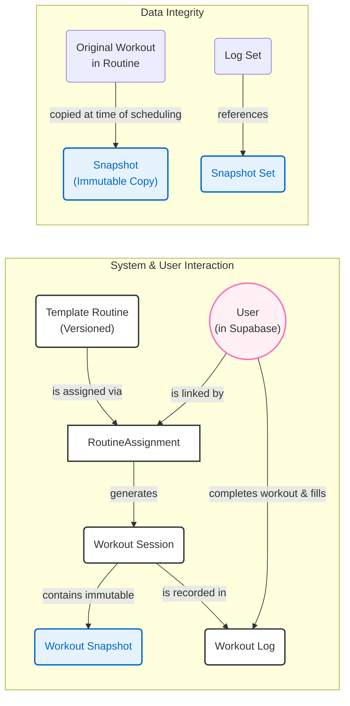

# PeakHealth Data Models

This document provides a comprehensive overview of the MongoDB data models for the PeakHealth workout application. The architecture is designed to be flexible, type-safe, and maintain historical data integrity, supporting a wide variety of workout types and user interactions.

---

## Core Concepts

The data model is divided into two main categories: **The Plan** (the structure of workouts and routines) and **The Action** (the execution and logging of those workouts by users).

### The Plan: Structuring Workouts

These models define the templates and building blocks for all workout programs.

-   **`Routine`**: The highest-level container, representing a complete workout program (e.g., a 6-week strength plan). There are two main types:
    -   `TemplateRoutine`: A version-controlled, read-only routine created by trainers or the company.
    -   `UserCreatedRoutine`: A fully editable routine created or copied by a user for personal use.

-   **`Workout`**: A single day's workout within a routine (e.g., "Day 1: Upper Body"). The model uses a union type to support different workout modalities like `StrengthWorkout`, `RunningWorkout`, etc.

-   **`Section`**: A phase within a workout, composed of exercises (e.g., "Warmup," "Main Lift," "EMOM," or "Intervals").

-   **`Exercise` & `Set`**: The lowest-level components. An `Exercise` references a master exercise definition in the Supabase database to maintain a single source of truth. `Set`s define the prescribed work (e.g., reps, weight, duration).

### The Action: Executing and Logging Workouts

These models track a user's interaction with the planned routines and capture their performance.

-   **`RoutineAssignment`**: The link between a user and a specific version of a `TemplateRoutine`. This model tracks the user's overall progress through the assigned program.

-   **`WorkoutSession`**: Represents a single, scheduled instance of a workout from a routine. It holds an immutable **snapshot** of the planned workout, ensuring historical data is preserved even if the original template changes.

-   **`WorkoutLog`**: A detailed record of the user's actual performance for a `WorkoutSession`. It mirrors the structure of the snapshot, allowing for a direct comparison between the planned work and the actual work performed for each set.

---

## Key Architectural Patterns

-   **Versioning and Immutability**: `TemplateRoutine` documents are versioned. When a trainer updates a routine, a new version is created, and the old one is marked as outdated but remains unchanged. `RoutineAssignment`s are always linked to a specific, immutable version, ensuring a user's plan is stable.

-   **Historical Accuracy via Snapshots**: The `workoutSnapshot` inside each `WorkoutSession` is a critical feature. It freezes the workout's structure at the moment it's scheduled, guaranteeing that historical logs always reflect the plan as it was, not as it is now.

-   **Composition with Union Types**: To support variety, the models for `Workout`, `Section`, `Exercise`, and `Set` are all defined as TypeScript union types. This allows for a `StrengthWorkout` to be composed of `EMOMSection`s, while a `RunningWorkout` can contain `IntervalSection`s, all within a strongly-typed and consistent structure.

-   **Supabase Integration**: To avoid duplicating data, all exercise metadata (name, muscle groups, equipment, video links) is stored in a central Supabase database. The MongoDB `Exercise` models store two references: `exerciseId` to the base exercise (e.g., "Squat") and a required `exerciseVariantId` to the specific version used (e.g., "Barbell High-Bar Squat"). This ensures users always interact with a concrete exercise variant.

---

## Data Flow Diagrams

### 1. Workout Structure (The Plan)

This diagram shows the hierarchical composition of a routine.

### 2. Workout Execution Flow (The Action)

This diagram illustrates how a user is assigned a routine and logs their performance.

---

## Model File Reference

-   **[routine.md](./routine.md)**: Defines `UserCreatedRoutine`, `TemplateRoutine`, and `RoutineAssignment`.
-   **[workout-session.md](./workout-session.md)**: Defines the `WorkoutSession` model for scheduled workouts, including the `workoutSnapshot`.
-   **[workout-log.md](./workout-log.md)**: Defines the `WorkoutLog` model for capturing user performance.
-   **[workout.md](./workout.md)**: Defines the `Workout` union type (`Strength`, `Running`, etc.) and its base structure.
-   **[sections/common.md](./sections/common.md)**: Defines common section types like `Warmup` and `Cooldown`.
-   **[sections/strength.md](./sections/strength.md)**: Defines section types specific to strength workouts (`EMOM`, `Circuit`).
-   **[sections/running.md](./sections/running.md)**: Defines section types specific to running workouts (`Intervals`, `Tempo`).
-   **[exercises.md](./exercises.md)**: Defines the `Exercise` and `Set` models, which reference the Supabase library.
