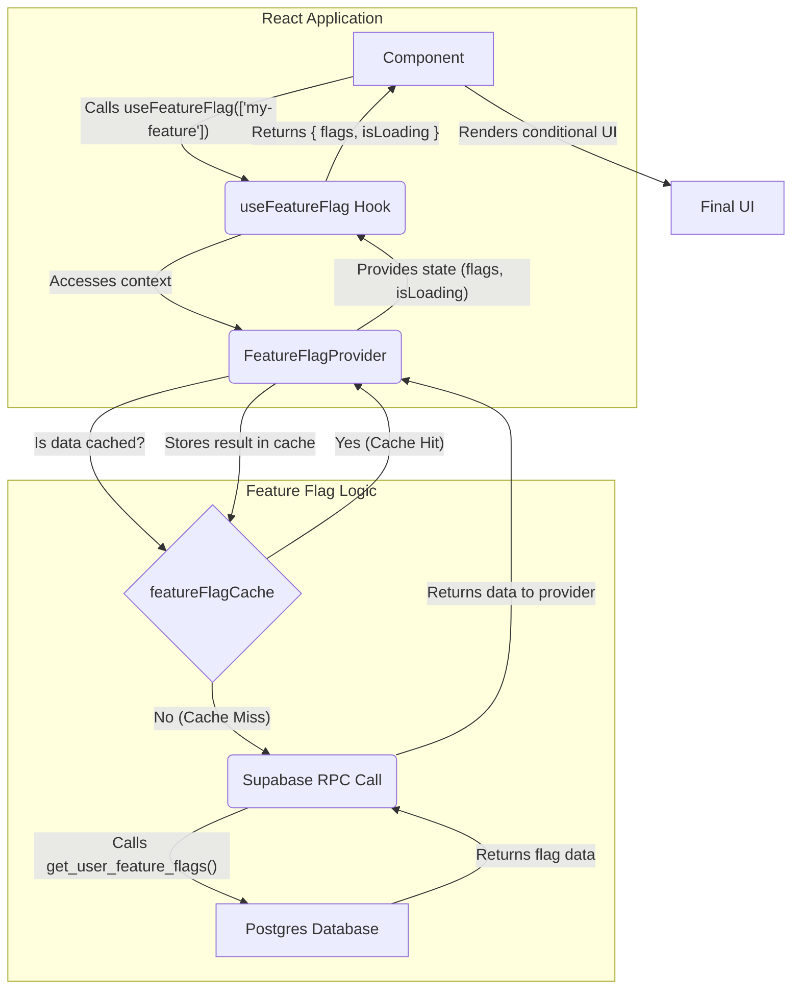

# Feature Flag System

A comprehensive feature flag system for the Peak Health app that supports user types, user groups, and environment-based targeting.

## System Workflow

This diagram provides a visual representation of the data flow within the feature flag system, from a component request to the database and back.



### Explanation of the Flow

1.  **Component Request**: A React component initiates the process by calling the `useFeatureFlag` hook with an array of feature names it needs to check.
2.  **Context Access**: The `useFeatureFlag` hook accesses the `FeatureFlagProvider` to get the current state and the `isEnabled` function.
3.  **Cache Check**: The `FeatureFlagProvider` first checks the `featureFlagCache` to see if the requested data is already available and not expired. If it is, the provider immediately uses the cached data (Cache Hit).
4.  **Cache Miss & RPC Call**: If the data is not in the cache (a "cache miss"), the provider makes an RPC call to the Supabase backend.
5.  **Database Query**: The `get_user_feature_flags` function in the database is executed. It queries the relevant tables to determine which flags are active for the current user and environment.
6.  **Data Return**: The database function returns the flag data to the `FeatureFlagProvider`.
7.  **Cache Update**: The provider updates the `featureFlagCache` with the newly fetched data for future requests.
8.  **State Provision**: The `FeatureFlagProvider` makes the latest state (flags and `isLoading` status) available to the hook.
9.  **Hook Return**: The `useFeatureFlag` hook returns the final state to the calling component.
10. **UI Render**: The component uses the flag's status to render the appropriate UI.

## Features

- **User Type Targeting**: Target features based on user types (regular, trainer, physio, admin)
- **User Group Targeting**: Target features based on user groups (beta, premium, early_access)
- **Environment Support**: Different configurations for development, staging, and production
- **Caching**: Built-in caching for performance optimization
- **Monitoring Ready**: Infrastructure for future monitoring integration
- **Audit Trail**: Track changes to feature flags
- **TypeScript Support**: Full type safety throughout the system

## Project Structure

The feature flag system is organized within the `src/features/feature-flags/` directory:

```
src/features/feature-flags/
├── types/
│   └── index.ts                 # All TypeScript interfaces and types
├── lib/
│   ├── config.ts               # Configuration and constants
│   ├── cache.ts                # Caching layer
│   └── monitoring.ts           # Monitoring infrastructure
├── context/
│   └── FeatureFlagContext.tsx  # Main context provider
├── hooks/
│   └── useFeatureFlag.ts       # Main feature flag hook
└── index.ts                    # Main export file
```

## Database Schema

The system uses the following tables:

- `user_types` - User type definitions
- `user_groups` - User group definitions
- `user_type_assignments` - User to type assignments (many-to-many)
- `user_group_assignments` - User to group assignments (many-to-many)
- `feature_flags` - Feature flag definitions
- `feature_flag_environments` - Environment-specific configurations
- `feature_flag_user_types` - Type-based targeting
- `feature_flag_user_groups` - Group-based targeting
- `feature_flag_audit_log` - Change tracking

## Setup

### 1. Run Database Migration

```bash
# Apply the migration to your Supabase database
supabase db push
```

### 2. Add FeatureFlagProvider to Your App

```tsx
// In your main layout or app component
import { FeatureFlagProvider } from '@/features/feature-flags';

function App() {
  return (
    <AuthProvider>
      <FeatureFlagProvider>{/* Your app components */}</FeatureFlagProvider>
    </AuthProvider>
  );
}
```

## Usage

### Using the useFeatureFlag Hook

```tsx
import { useFeatureFlag, FEATURE_FLAGS } from '@/features/feature-flags';

function MyComponent() {
  const { flags, isLoading } = useFeatureFlag([
    FEATURE_FLAGS.NOTIFICATION_SYSTEM_FEATURE,
  ]);

  if (isLoading) return <div>Loading...</div>;

  return (
    <div>
      {flags[FEATURE_FLAGS.NOTIFICATION_SYSTEM_FEATURE] ? (
        <NotificationsComponent />
      ) : (
        <NoNotificationsMessage />
      )}
    </div>
  );
}
```

### Using the useFeatureFlags Hook for More Control

The `useFeatureFlags` hook gives you direct access to the context, which is useful for more complex scenarios, such as checking user types or groups.

```tsx
import {
  useFeatureFlags,
  USER_TYPES,
  USER_GROUPS,
} from '@/features/feature-flags';

function MyComponent() {
  const { hasUserType, isInGroup, isEnabled } = useFeatureFlags();

  // Check user types
  const isTrainer = hasUserType(USER_TYPES.TRAINER);
  const isPhysio = hasUserType(USER_TYPES.PHYSIO);

  // Check user groups
  const isBetaUser = isInGroup(USER_GROUPS.BETA);
  const isPremiumUser = isInGroup(USER_GROUPS.PREMIUM);

  // Check feature flags
  const hasNotifications = isEnabled('notification_system_feature');

  return (
    <div>
      {isTrainer && <TrainerDashboard />}
      {isPremiumUser && <PremiumFeatures />}
      {hasNotifications && <NotificationsComponent />}
    </div>
  );
}
```

## Configuration

### Environment Variables

```env
# Feature Flag Configuration
FEATURE_FLAG_MONITORING_ENABLED=false
FEATURE_FLAG_MONITORING_ENDPOINT=
FEATURE_FLAG_MONITORING_API_KEY=
FEATURE_FLAG_CACHE_TTL=300000
FEATURE_FLAG_ANALYTICS_ENABLED=true
NEXT_PUBLIC_ENVIRONMENT=development
```

### Feature Flag Constants

```tsx
import {
  FEATURE_FLAGS,
  USER_TYPES,
  USER_GROUPS,
} from '@/features/feature-flags';

// Available feature flags
FEATURE_FLAGS.NOTIFICATION_SYSTEM_FEATURE;

// Available user types
USER_TYPES.REGULAR;
USER_TYPES.TRAINER;
USER_TYPES.PHYSIO;
USER_TYPES.ADMIN;

// Available user groups
USER_GROUPS.BETA;
USER_GROUPS.PREMIUM;
USER_GROUPS.EARLY_ACCESS;
```

## Testing

### Manual Testing

1. **Assign User Types**: Use the database to assign user types to test users
2. **Assign User Groups**: Use the database to assign user groups to test users
3. **Toggle Feature Flags**: Enable/disable feature flags in different environments
4. **Test Targeting**: Verify that features appear/disappear based on user types and groups

## Database Management

### Assign User Types

```sql
-- Assign a user as a trainer
INSERT INTO user_type_assignments (user_id, user_type_id)
SELECT 'user-uuid', id FROM user_types WHERE name = 'trainer';

-- Assign multiple types to a user
INSERT INTO user_type_assignments (user_id, user_type_id)
SELECT 'user-uuid', id FROM user_types WHERE name IN ('regular', 'trainer', 'physio');
```

### Assign User Groups

```sql
-- Add user to beta group
INSERT INTO user_group_assignments (user_id, group_id)
SELECT 'user-uuid', id FROM user_groups WHERE name = 'beta';

-- Add user to premium group
INSERT INTO user_group_assignments (user_id, group_id)
SELECT 'user-uuid', id FROM user_groups WHERE name = 'premium';
```

### Create Feature Flags

```sql
-- Create a new feature flag
INSERT INTO feature_flags (name, display_name, description)
VALUES ('new_feature', 'New Feature', 'Description of the new feature');

-- Enable it for specific environment
INSERT INTO feature_flag_environments (feature_flag_id, environment, is_enabled, rollout_percentage)
SELECT id, 'production', true, 100 FROM feature_flags WHERE name = 'new_feature';

-- Target specific user types
INSERT INTO feature_flag_user_types (feature_flag_id, environment, user_type_id, is_enabled)
SELECT ff.id, 'production', ut.id, true
FROM feature_flags ff, user_types ut
WHERE ff.name = 'new_feature' AND ut.name = 'trainer';
```

## Performance

- **Caching**: Feature flags are cached for 5 minutes by default
- **Single Query**: All user data is loaded in one query
- **Indexes**: Database indexes for optimal query performance
- **Lazy Loading**: Data is only loaded when needed

## Monitoring (Future)

The system is designed to support monitoring integration:

- Performance metrics tracking
- Usage analytics
- Error tracking
- Health checks

## Security

- **Row Level Security (RLS)**: All tables have RLS enabled
- **User Isolation**: Users can only see their own data
- **Audit Trail**: All changes are logged
- **Type Safety**: Full TypeScript support prevents runtime errors

## Next Steps

1. **Integration**: Add the FeatureFlagProvider to your app
2. **Testing**: Test the notification system feature flag
3. **User Assignment**: Assign users to types and groups
4. **Feature Flags**: Create and configure feature flags for your features
5. **Monitoring**: Enable monitoring when ready
